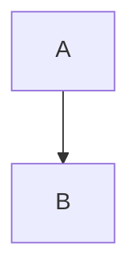

# Docs Authoring Guide

This repository maintains docs in `sp-laravel-api/docs` and syncs them into the VitePress site in `sp-laravel-api-docs`.

## Where to Edit

- Edit docs only in `sp-laravel-api/docs`
- Do not manually edit `sp-laravel-api-docs/docs` (generated by `sync_docsify_docs.sh`)

## Validation Commands

Run these before syncing/publishing docs:

- `composer docs:validate` (validates frontmatter + link style in `sp-laravel-api/docs`)
- `npm run docs:build && npm run docs:check-links` in `sp-laravel-api-docs` (validates built-site internal links)

## Frontmatter (Required)

Every Markdown file (except special VitePress home pages like `docs/index.md`) must start with YAML frontmatter:

```yaml
---
title: "Clear page title"
description: "1 sentence summary for search + AI retrieval"
keywords:
  - 3 to 10 short keywords
---
```

Rules:
- Keep `title` short and specific (no repeated “SP Laravel API …” prefix)
- Use `description` as the first sentence you want search + AI tools to read
- Add `keywords` that match what people will type (“record hooks”, “audit”, “tenancy”, “openapi”, etc.)

## VitePress Markdown Rules

- Use ATX headings: `#` for page title (once), then `##`, `###`
- Always tag code blocks with a language (`php`, `json`, `bash`, `ts`, `yaml`)
- Use VitePress-friendly internal links:
  - Prefer absolute site paths without extensions: `/guide/api-index`, `/core-concepts/relationships`
  - Avoid linking to `*.md` from docs that will be read in the website

### Mermaid

Use Mermaid blocks:

```md

```

If a diagram is big, add a short lead-in sentence describing what it shows.

## Claude + Trae Retrieval Rules

Write docs so an AI agent can load 1 file and answer quickly:

- Put the “answer” early (first 20–40 lines)
- Prefer smaller pages; split large pages into “chunked” pages under `docs/guide/*`
- Add “Related Docs” links at the bottom
- Avoid vague headings like “Overview”; prefer “Auth”, “Tenancy”, “Cache”, “Endpoints”, “Examples”
- Include at least one realistic request/response example for API behavior pages

## OpenAPI Consistency Rules

When writing API docs for an endpoint, include these sections in this order:

1. **Endpoint**: `METHOD /path`
2. **Auth**: guard, headers, permissions (if any)
3. **Query Params**: table (name, type, required, example)
4. **Request Body** (if any): JSON example + field notes
5. **Response Envelope**: always show `{ success, error_code, data, meta }`
6. **Errors**: list common error_code values with causes

If the docs describe behavior controlled by config, link to the config-driven source page (usually in `docs/guide/api/*` or `docs/core-concepts/*`) and keep wording consistent with the OpenAPI export.

## Link Rules (Important)

- For links within the VitePress website, use absolute paths without `.md`
- For links inside GitHub-only text (rare), use relative links, but keep them consistent and avoid mixing styles on the same page
