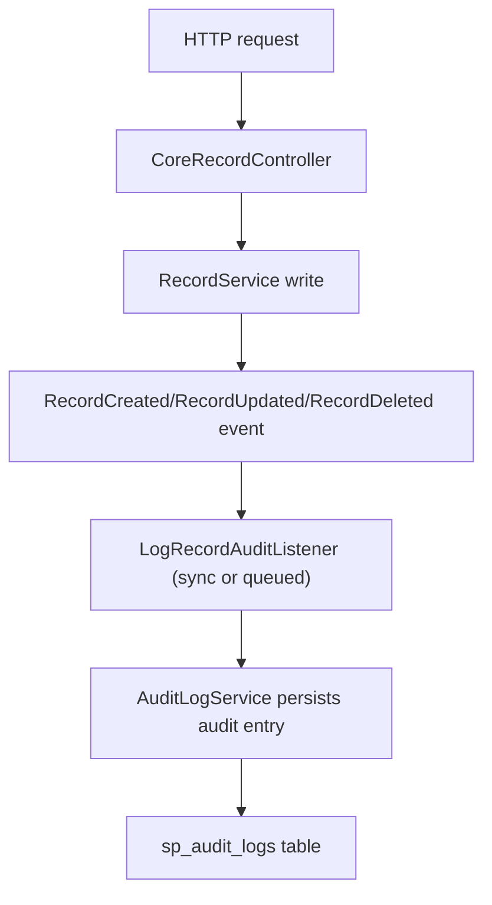

# Audit Module

Audit support is available through three patterns:

- Dynamic Record API with per-table controls
- Manual controller/service-level audit insertion
- Eloquent model-level auditing via trait



## Setup & Access
By default, the `sp_audit_logs` table is registered as a read-only endpoint in the dynamic API system. 

```bash
# Retrieve all audit logs (with pagination, filtering, etc)
GET /api/v1/sp_audit_logs

# Attempting to Create, Update, or Delete will return a 403 Forbidden error
POST /api/v1/sp_audit_logs  # 403 Forbidden
```

To modify this behavior, publish the configuration and edit `config/sp-audit.php`.

## Core Controls

- Global enable/disable via `config('audit.enabled')`
- Queue mode via `config('audit.queue_enabled')`
- Per-table control via `RecordTableType` (`disableAuditLog`, `customAuditLog`)

## Optional mutation admission policy

Set `filter` in `config/sp-audit.php` (canonical runtime key: `audit.filter`). Missing/null preserves existing behavior and does not resolve any policy. No migration or mandatory config republish is needed.

```php
'filter' => App\Audit\MutationPolicy::class,
```

Implement the package interface in the consuming application:

```php
<?php

namespace App\Audit;

use Illuminate\Contracts\Auth\Authenticatable;
use Sopheak\Core\Enums\AuditLogEventEnum;
use Sopheak\Core\Interfaces\AuditLogFilterInterface;

final class MutationPolicy implements AuditLogFilterInterface
{
    public function shouldLog(
        AuditLogEventEnum $event,
        string $table,
        array $auditData,
        ?Authenticatable $user,
        array $context = [],
    ): bool {
        // Keep business-critical changes regardless of actor.
        if (in_array($table, ['payments', 'permissions'], true)) {
            return true;
        }

        // Example application-owned rule; the package assumes no role/type schema.
        return !($table === 'device_locations'
            && $event === AuditLogEventEnum::UPDATED
            && $user !== null);
    }
}
```

Alternatively configure `[MutationPolicy::class, 'shouldLog']` for a public static or container-resolved instance method. Class-only policies implement `AuditLogFilterInterface`. Constructor dependencies use the container. Explicitly configuring the interface name also works when the application binds it to an implementation. Binding alone does not enable filtering.

Use class strings or class/method arrays in cached config, never closures or instances. Run `php artisan sp-laravel-api:validate` to check class/method configuration without invoking the policy. After deployment, rebuild cached config and reload long-running workers through the application's normal procedure.

### Decisions and failure behavior

The hook runs once per submission through `insertAuditLog`, `insertAuditLogWithContext`, or `log`, before audit history lookup, diff reduction, persistence, or `AuditLogJob` dispatch. Only CREATED, UPDATED, and DELETED events are filtered. Restore retains its existing UPDATED mapping; use the record `operation` context to distinguish it.

Return a boolean: false skips this audit submission; true continues existing processing, including no-change suppression. It does not authorize a business write, enable disabled auditing, or force an audit row to exist. Rejection does not skip record triggers or broadcasts.

Invalid config, resolution failures, callback exceptions, and non-boolean results retain the audit and emit a sanitized warning. This protects audit coverage and business writes, but means a policy error can increase storage. It is not a privacy/redaction guarantee. Diagnostics contain a reason and filter identifier, never the audited payload or exception message.

`disableAuditLog` and existing `customAuditLog` behavior are preserved. A callable custom logger consumes the built-in audit regardless of its return value, including void/null/false. A custom logger calling the package submission API is subject to filtering there; direct custom storage is its own responsibility.

### Context and request isolation

`$auditData` is the incoming payload. Old/new snapshots and complete diffs are not guaranteed. The hook does not fetch historical data to manufacture them.

| Context key | Meaning |
| --- | --- |
| `table` | Record table key, or the existing entity-to-table resolver result for manual submissions. |
| `operation` | Record operation; generic manual submissions use the enum value. Inner bulk-upsert submissions retain `update`, wrapper submissions use `upsert`. |
| `tenant_id` | Explicit audit tenant argument; overrides a conflicting context value. |
| `source` | `record` for post-write/bulk orchestration, `manual` for manual submission. |
| `request` | Supplied/current HTTP request, otherwise null. |
| `record_context` / `request_context` | Existing record metadata, or empty arrays. |
| `actor` | Optional explicit actor or null for the context-aware API; controls the `$user` argument. |

Explicit `actor: null` stays anonymous/system. Otherwise a supplied request's user resolver determines the actor; a request resolving null never falls back to a different guard. Generic console submissions have no actor/request by default. Policies must remain stateless: do not capture requests/users in singleton constructors, cache decisions, or mutate config between requests. Runtime context is not serialized into audit jobs and does not change existing stored attribution.

### Coverage boundaries

The policy controls the built-in submission API, not every write to the audit table. Direct `handleAuditDataEntry`, `createAuditLogEntry`, direct job dispatch, and `AuditableTrait` bypass this admission API. Authentication via `authEvent`, LOGIN/LOGOUT/FAILED_LOGIN, and GET events remains unchanged.

Queued `LogRecordAuditListener` calls `log` in its worker: filtering happens there with generic worker context, not before the listener was enqueued. For actor-dependent decisions before queueing, use the context-aware submission API directly. Already submitted `AuditLogJob` jobs are not re-filtered when they execute or retry.

Bulk upsert currently submits through both an inner update and the bulk wrapper. This feature preserves that existing behavior and evaluates each submission independently; it does not deduplicate audits or alter transaction/after-commit timing.

See [manual audit logging](/guide/features/feature-audit-manual-controller) for explicit actor and tenant examples.

## Record Lifecycle Events

When a dynamic table write succeeds, the package dispatches Laravel 13-safe domain events that carry an `auditContext` array (serializable primitives) instead of a full `Request` object:

- `Sopheak\Core\Events\RecordCreated`
- `Sopheak\Core\Events\RecordUpdated`
- `Sopheak\Core\Events\RecordDeleted`

Audit persistence is executed by `LogRecordAuditListener` (queued when `audit.queue_enabled` is true).

## Advanced Features

### Change Diffing

You can configure the audit module to only store the differences between old and new data for `UPDATED` events to save database space.

- Enable via `config('audit.store_diff_only')`
- When enabled, `old_data` and `new_data` will only contain the fields that actually changed during the update.

### Archiving Old Logs

The package includes a command to clean up old audit logs. You can configure it to archive the logs to a storage disk before deletion.

- Enable via `config('audit.archive.enabled')`
- Configure storage disk via `config('audit.archive.disk')`
- Configure archive path via `config('audit.archive.path')`

Run the cleanup command:
```bash
php artisan sp-laravel-api:clean-audit-logs
```
When archiving is enabled, this command will chunk the old logs, serialize them to a JSONL file on the configured storage disk, and then safely delete them from the database.

### Request Tracking

The audit log automatically tracks request context by populating dedicated columns:

- `ip_address`: The IP address of the requester.
- `user_agent`: The User-Agent string of the requester.
- `request_id`: Extracted from the `X-Request-ID` header (if present) for request tracing across services.
- `user_id`: The authenticated user at the time of the event.

### Userstamps vs Audit Logs

Audit logs are event history. Separately, business tables can carry
**userstamp columns** (`created_by`, `created_by_id`, `updated_by`,
`last_updated_by`, `last_updated_by_id`) that the package auto-fills with the
authenticated user's ID on every create/update — answering "who owns this row?"
on the row itself. The two are independent and both optional; see
[Userstamps](/guide/feature-userstamps).

## Related Feature Docs

- [Audit in Controller Flow](/guide/feature-audit-manual-controller)
- [Audit in Dynamic Record API](/guide/feature-audit-record-hooks)
- [Userstamps](/guide/feature-userstamps)
