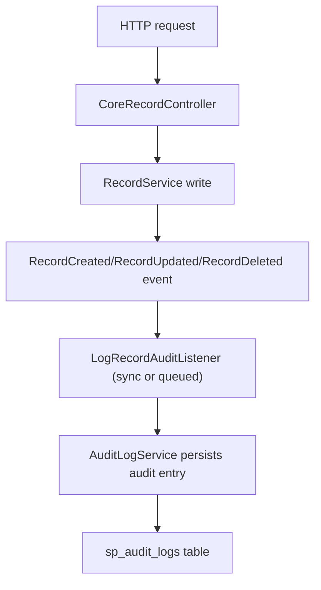

# Audit Module

Audit support is available through three patterns:

- Dynamic Record API with per-table controls
- Manual controller/service-level audit insertion
- Eloquent model-level auditing via trait



## Setup & Access
By default, the `sp_audit_logs` table is registered as a read-only endpoint in the dynamic API system. 

```bash
# Retrieve all audit logs (with pagination, filtering, etc)
GET /api/v1/sp_audit_logs

# Attempting to Create, Update, or Delete will return a 403 Forbidden error
POST /api/v1/sp_audit_logs  # 403 Forbidden
```

To modify this behavior, publish the configuration and edit `config/audit.php`.

## Core Controls

- Global enable/disable via `config('audit.enabled')`
- Queue mode via `config('audit.queue_enabled')`
- Per-table control via `RecordTableType` (`disableAuditLog`, `customAuditLog`)

## Record Lifecycle Events

When a dynamic table write succeeds, the package dispatches Laravel 13-safe domain events that carry an `auditContext` array (serializable primitives) instead of a full `Request` object:

- `Sopheak\Core\Events\RecordCreated`
- `Sopheak\Core\Events\RecordUpdated`
- `Sopheak\Core\Events\RecordDeleted`

Audit persistence is executed by `LogRecordAuditListener` (queued when `audit.queue_enabled` is true).

## Advanced Features

### Change Diffing

You can configure the audit module to only store the differences between old and new data for `UPDATED` events to save database space.

- Enable via `config('audit.store_diff_only')`
- When enabled, `old_data` and `new_data` will only contain the fields that actually changed during the update.

### Archiving Old Logs

The package includes a command to clean up old audit logs. You can configure it to archive the logs to a storage disk before deletion.

- Enable via `config('audit.archive.enabled')`
- Configure storage disk via `config('audit.archive.disk')`
- Configure archive path via `config('audit.archive.path')`

Run the cleanup command:
```bash
php artisan sp-laravel-api:clean-audit-logs
```
When archiving is enabled, this command will chunk the old logs, serialize them to a JSONL file on the configured storage disk, and then safely delete them from the database.

### Request Tracking

The audit log automatically tracks request context by populating dedicated columns:

- `ip_address`: The IP address of the requester.
- `user_agent`: The User-Agent string of the requester.
- `request_id`: Extracted from the `X-Request-ID` header (if present) for request tracing across services.

## Related Feature Docs

- [Audit in Controller Flow](/guide/feature-audit-manual-controller)
- [Audit in Dynamic Record API](/guide/feature-audit-record-hooks)
