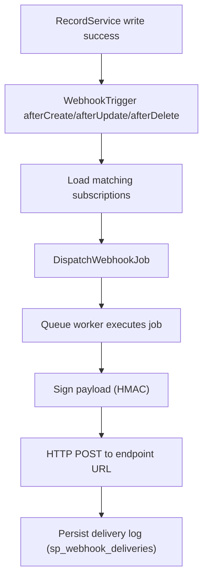

# Webhook Module Architecture & Requirements



## 1. Architectural Space (Folder Structure)

The Webhook module will be fully integrated into the `sp-laravel-api` core engine, following the same pattern as the Attachments module.

*   **Configuration:** `config/webhooks.php` (Defines tables using `RecordTableType` for instant CRUD APIs).
*   **Migrations:** `database/migrations/xxxx_create_sp_webhooks_tables.php`
*   **Service:** `src/Services/WebhookService.php` (Handles payload formatting, HMAC signature generation, and dispatching).
*   **Jobs:** `src/Jobs/DispatchWebhookJob.php` (Asynchronous queue processing to prevent API blocking).
*   **Triggers:** `src/Triggers/WebhookTrigger.php` (Global listener using `#[RecordTrigger]` for `afterCreate`, `afterUpdate`, and `afterDelete`).

---

## 2. Database Schema Requirements

The module requires 3 tables to ensure robust, enterprise-ready webhook management and auditing.

### A. `sp_webhook_endpoints` (The Destination)
Stores the external URLs that will receive the webhook payloads.
*   `id` (uuid, primary key)
*   `tenant_id` (string, nullable, indexed)
*   `name` (string) - e.g., "Zapier Integration", "Slack Notifier"
*   `url` (string) - The destination HTTP/HTTPS URL
*   `secret` (string) - Used to sign the payload (HMAC SHA256) for receiver verification
*   `is_active` (boolean, default: true) - Toggle to pause/resume webhooks
*   `timestamps`

### B. `sp_webhook_subscriptions` (The Listeners)
Defines which events an endpoint is interested in.
*   `id` (uuid, primary key)
*   `tenant_id` (string, nullable, indexed)
*   `endpoint_id` (uuid, foreign key to `sp_webhook_endpoints`)
*   `table_name` (string) - e.g., `users`, `invoices`, or `*` for all tables
*   `event` (string) - e.g., `created`, `updated`, `deleted`, or `*` for all events
*   `timestamps`

### C. `sp_webhook_deliveries` (The Audit Log)
Crucial for debugging, this logs every attempt to send a webhook.
*   `id` (uuid, primary key)
*   `tenant_id` (string, nullable, indexed)
*   `endpoint_id` (uuid, foreign key to `sp_webhook_endpoints`)
*   `event` (string) - e.g., `invoices.created`
*   `payload` (json) - The exact data payload sent
*   `response_status` (integer, nullable) - HTTP status code (e.g., 200, 404, 500)
*   `response_body` (text, nullable) - The response received from the endpoint
*   `status` (enum: `pending`, `success`, `failed`)
*   `timestamps`

---

## 3. Core Logic & Integration Flow

1.  **The Trigger:** The `WebhookTrigger` class uses `#[RecordTrigger]` attributes to hook into the global `afterCreate`, `afterUpdate`, and `afterDelete` lifecycle events of the `RecordService`.
2.  **The Matcher:** When a record is modified (e.g., an invoice is created), the trigger queries `sp_webhook_subscriptions` to find active endpoints listening to `invoices.created` for the current `tenant_id`.
3.  **The Dispatch:** For every matching subscription, a `DispatchWebhookJob` is dispatched to Laravel's queue system.
4.  **The Execution:** The Job processes asynchronously:
    *   Generates an HMAC SHA256 signature using the endpoint's `secret`.
    *   Sends the HTTP POST request using Laravel's `Http` facade.
    *   Records the outcome (success/failure, status code, response body) in the `sp_webhook_deliveries` table.

---

## 4. Configuration (`config/webhooks.php`)

The tables will be exposed via the dynamic API engine, allowing frontend applications to build webhook management UIs instantly.

```php
<?php

use Sopheak\Core\Types\RecordTableType;

return [
    'enabled' => env('SP_LARAVEL_API_WEBHOOKS_ENABLED', true),
    
    'tables' => [
        'sp_webhook_endpoints' => new RecordTableType(
            table: 'sp_webhook_endpoints',
            pmsName: 'webhook',
            hasTenantId: true,
            isAuthRead: true,
            isAuthWrite: true,
            // ... columns definition
        ),
        'sp_webhook_subscriptions' => new RecordTableType(
            table: 'sp_webhook_subscriptions',
            pmsName: 'webhook',
            hasTenantId: true,
            isAuthRead: true,
            isAuthWrite: true,
            // ... columns definition
        ),
        'sp_webhook_deliveries' => new RecordTableType(
            table: 'sp_webhook_deliveries',
            pmsName: 'webhook',
            hasTenantId: true,
            isAuthRead: true,
            isAuthWrite: false, // Deliveries should be read-only via API
            // ... columns definition
        ),
    ],
];
```
