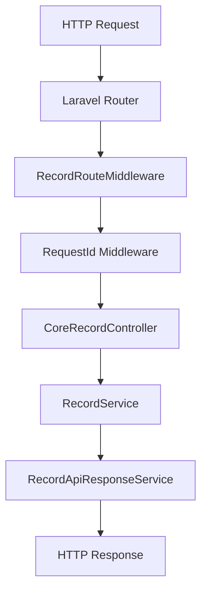

## Architecture Overview

### Design Philosophy

SP Laravel API is a **config-driven dynamic CRUD package**. You describe a table once in `RecordTableType` and the package registers all endpoints, enforces auth, applies tenant scoping, runs audit logging, and handles caching — with zero boilerplate controllers or routes in your application.

**Core principles:**

- **Config over code** — behavior is declared in `RecordTableType`, not implemented in controller methods.
- **DB-first, not model-first** — the package queries the database directly via `QueryBuilder`. Eloquent models are never required (and never instantiated by the package).
- **Composable opt-ins** — every non-trivial feature (tenancy, audit, cache, permissions, broadcast, bulk) is off by default and activated per-table or globally via config.
- **Strict backward compatibility** — new config keys always have safe defaults so existing clients upgrade without changes.

---

### Request Lifecycle

A full lifecycle for `GET /api/v1/invoices?status=eq.open&per_page=25`:



```
1. HTTP Request arrives
       │
       ▼
2. Laravel Router
   routes/api.php  →  CoreRecordController@listRecords
   (route registered by CoreSpLaravelApiProvider::boot)
       │
       ▼
3. RecordRouteMiddleware  (aliased: record.route.middleware)
   - resolves the action string (e.g. "read")
   - looks up middleware map from config/record.php middleware_map
   - pipes request through the resolved middleware stack
   - e.g. [auth:api, throttle:api-reads, subscription.check]
       │
       ▼
4. RequestId middleware
   - generates / propagates X-Request-ID header
   - stored in request attributes for response inclusion
       │
       ▼
5. CoreRecordController  (HasControllerHelpers trait)
   authorizeAction():
   - PermissionUtils checks if action is public
   - auth($guard)->user() resolves the authenticated user
   - Gate::forUser($user)->allows($perm) or custom authorizer
       │
       ▼
6. RecordService::listRecords()
   - SchemaRegistryUtils::getTable($table) → RecordTableType
   - tenant ID resolved from request header / attributes
   - QueryBuilder assembled with filters, sort, pagination
   - applyRequestFilters() applies all query params
   - relationships loaded via select= syntax
   - cache check (QueryCacheService) — return cached if hit
       │
       ▼
7. RecordApiResponseService::successWrapped()
   - wraps data in { success, error_code, data, meta }
   - injects request_id into meta
       │
       ▼
8. HTTP Response → client
```

For **write** operations (POST / PUT / PATCH / DELETE), step 6 expands:

```
6a. tableValidator runs (if defined)
6b. beforeCreate / beforeUpdate / beforeDelete trigger fires
6c. DB write (INSERT / UPDATE / DELETE)
6d. afterCreate / afterUpdate / afterDelete trigger fires
6e. Record lifecycle event dispatched (Laravel 13 safe):
    → RecordCreated / RecordUpdated / RecordDeleted
6f. Listeners handle side-effects:
    → InvalidateRecordCacheListener clears table cache
    → LogRecordAuditListener calls AuditLogService (queued when queue is enabled)
6g. RecordMutated::dispatch (if broadcast enabled)
```

---

### Record Lifecycle Events (Laravel 13 Safe)

The package dispatches internal domain events after a successful write. These events are designed to be safe for Laravel 13 queue serialization (no `Request` objects; only primitives and arrays).

| Event | Dispatched when | Payload |
|---|---|---|
| `Sopheak\Core\Events\RecordCreated` | After a successful create | `table`, `payload`, `id`, `auditContext` |
| `Sopheak\Core\Events\RecordUpdated` | After a successful update | `table`, `oldPayload`, `newPayload`, `id`, `auditContext` |
| `Sopheak\Core\Events\RecordDeleted` | After a successful delete | `table`, `oldPayload`, `id`, `auditContext` |

**`auditContext` keys** (subject to availability):
- `ip`
- `user_agent`
- `user_id`
- `request_id`

These events are used internally to decouple side-effects (audit logging and cache invalidation) from the main write flow. You can also listen to them in your host application to trigger additional internal behaviors (e.g., webhooks, async projections, analytics).

### Component Map

| Component | Location | Responsibility |
|---|---|---|
| `CoreSpLaravelApiProvider` | `src/` | Registers routes, middleware aliases, Artisan commands, singleton bindings |
| `CoreRecordController` | `src/Http/Controllers/` | Single controller — composes all 4 traits |
| `HasControllerHelpers` | `Concerns/` | Auth check, tenant resolution, validator runner, transaction wrapper |
| `HasCrudOperations` | `Concerns/` | List, show, create, update, delete, restore, force-delete |
| `HasBulkOperations` | `Concerns/` | Bulk create / update / delete / upsert |
| `HasFunctionOperations` | `Concerns/` | Table RPC and global RPC dispatch |
| `RecordService` | `src/Services/` | All DB operations, trigger execution, post-write logic orchestration |
| `RecordConfigService` | `src/Services/` | Static accessors for all config values (`authGuard`, `tenantColumn`, `broadcastEventsEnabled`, …) |
| `RecordApiResponseService` | `src/Services/` | Unified response envelope (`success`, `error_code`, `data`, `meta`) |
| `AuditLogService` | `src/Services/` | Builds and persists audit log entries, field-level change tracking |
| `QueryCacheService` | `src/Services/` | Cache key generation, cache read/write, per-table TTL |
| `OpenApiService` | `src/Services/` | Generates OpenAPI 3.0 spec dynamically from registry |
| `AttributeDiscoveryService` | `src/Services/` | Scans model paths for `#[RecordTable]` attributes, builds `RecordTableType` instances |
| `SchemaRegistryUtils` | `src/Utilities/` | In-memory registry of all `RecordTableType` configs (file-based + attribute-discovered) |
| `RecordRouteMiddleware` | `src/Http/Middleware/` | Resolves and pipelines per-action middleware from `record.middleware_map` |
| `RequestId` | `src/Http/Middleware/` | Generates/propagates `X-Request-ID`, injects into response |
| `RecordMutated` | `src/Events/` | Broadcast event dispatched after every mutation |
| `RecordTableType` | `src/Types/` | The central config object — all table behavior is declared here |

---

### Schema Registry

`SchemaRegistryUtils` is the single source of truth for all table configurations at runtime.

```
config/record.php  ──────────────────────────────┐
config/records/tables/*.php  ────────────────────▶  SchemaRegistryUtils::get()
#[RecordTable] attribute discovery (opt-in)  ────┘         │
                                                            │  in-memory map:
                                                            │  [ 'invoices' => RecordTableType, ... ]
                                                            ▼
                                                     RecordService
                                                     OpenApiService
                                                     HasControllerHelpers
                                                     ListTablesCommand
```

**Priority order (highest wins):**
1. `config/record.php` inline `tables` array
2. Per-file `config/records/tables/{name}.php`
3. `#[RecordTable]` attribute discovery (if `SP_ATTRIBUTE_DISCOVERY=true`)

**`SchemaRegistryUtils` key methods:**

| Method | Purpose |
|---|---|
| `get()` | Returns full registry map, merging attribute-discovered tables |
| `getTable(string $key)` | Returns a single `RecordTableType` or `null` |
| `refresh()` | Clears the in-memory cache and forces a reload |

The registry is loaded once per request and held in a static property — no repeated config reads.

---

### Service Layer

**`RecordService`** is the core orchestration layer. The controller traits never touch the database directly — they delegate everything to `RecordService`.

```
Controller Trait  →  RecordService  →  QueryBuilder  →  Database
                           │
                           ├── executeTableTrigger()   (before/after hooks)
                           ├── executeGlobalTrigger()  (global before/after hooks)
                           ├── sanitizePayload()       (strips write-disabled columns)
                           ├── applyTimestampsAndAuditFields()
                           └── processPostWriteLogic() (audit + broadcast)
```

**`RecordConfigService`** is a pure static accessor layer — no state, no DB, just `config()` calls with typed return values. All other classes read config through it, never via raw `config()` calls, so config key names are centralized in one place.

**`RecordApiResponseService`** is bound as `api.response` singleton. Every response in the package goes through it so the envelope (`success`, `error_code`, `meta.request_id`) is guaranteed consistent.

---

### Controller Traits

`CoreRecordController` is a thin shell that composes four traits:

```php
class CoreRecordController extends Controller
{
    use HasControllerHelpers;   // auth, tenant, validators, transaction
    use HasCrudOperations;      // list, show, create, update, delete, restore, force-delete
    use HasBulkOperations;      // bulk create/update/delete/upsert
    use HasFunctionOperations;  // table RPC + global RPC
}
```

**Trait responsibilities:**

`HasControllerHelpers` — shared infrastructure used by all other traits:
- `authorizeAction()` — resolves user, maps permissions, calls Gate or custom authorizer
- `resolveTenantContext()` — extracts tenant ID from header / request attributes
- `runTableValidators()` — runs `createValidator` / `updateValidator` / `deleteValidator`
- `withinTransaction()` — wraps write operations in a DB transaction

`HasCrudOperations` — one method per HTTP verb:
- Each method follows: resolve schema → authorize → resolve tenant → run before-trigger → write → invalidate cache → run after-trigger → processPostWriteLogic → return response

`HasBulkOperations` — per-item loop with per-item trigger execution and post-write logic.

`HasFunctionOperations` — delegates to `RecordService::executeTableFunction` / `executeGlobalFunction`, which resolve function config from `RecordTableType::$functions` or `record.global_functions`.

---

### Middleware Pipeline

`RecordRouteMiddleware` uses Laravel's `Pipeline` to pipe each request through a dynamically resolved middleware stack.

```
config/record.php:
  middleware_map:
    read:   [auth:api, throttle:api-reads]
    write:  [auth:api, throttle:api-writes]
    public: [throttle:api-reads]
```

The middleware key (`read`, `write`, `public`, etc.) is passed as a route action parameter. `RecordRouteMiddleware::resolveMiddlewares()` looks up the key and returns the middleware array. If the table overrides middleware via `RecordTableType::$middlewareMap`, the table-level config takes precedence.

This means you can apply subscription checks, IP allow-lists, or custom rate limiters to specific action types without modifying the controller.

```
Route definition (routes/api.php):
  ->middleware('record.route.middleware:read')   ← key passed here
       │
       ▼
  RecordRouteMiddleware::handle()
       │
       ├── resolveMiddlewares($request, 'read')
       │     → checks RecordTableType::$middlewareMap first
       │     → falls back to config('record.middleware_map.read')
       │
       └── Pipeline::through($middlewares)->then($next)
```
