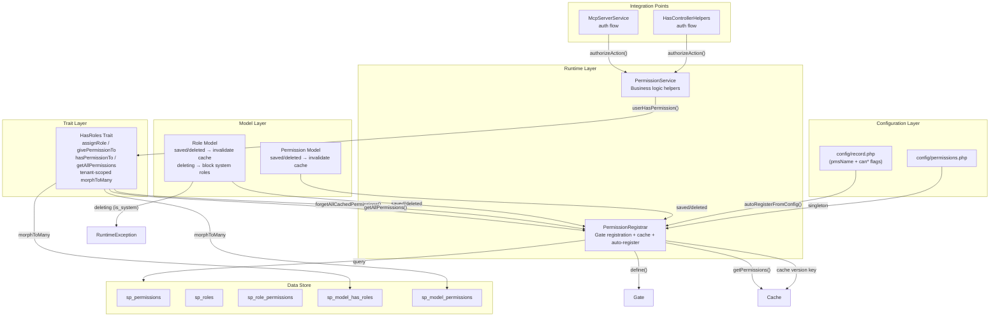
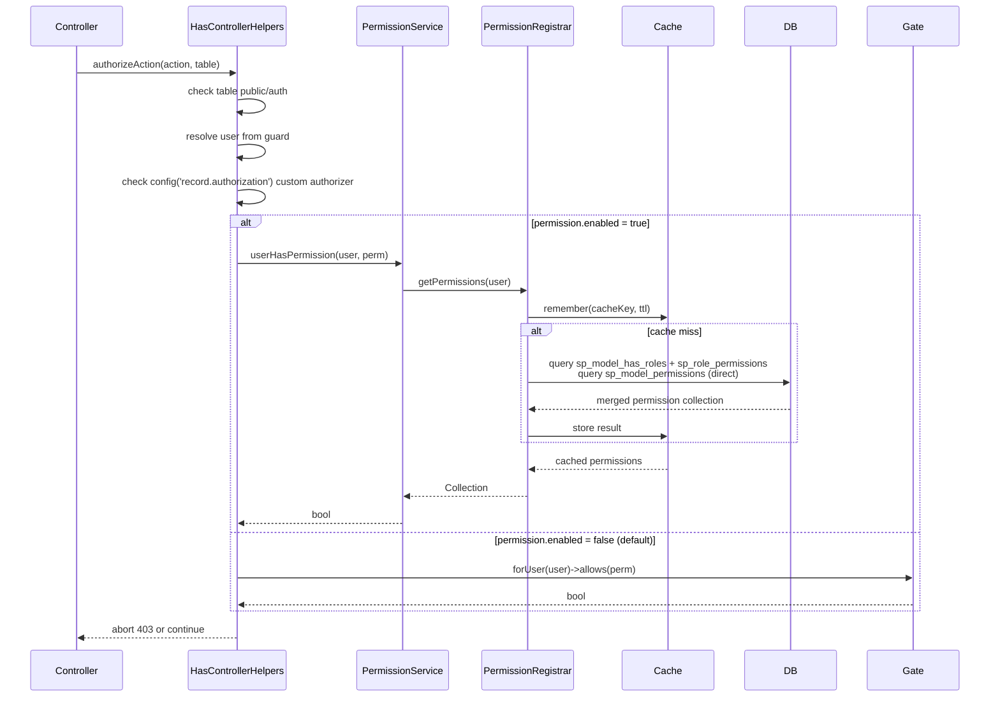
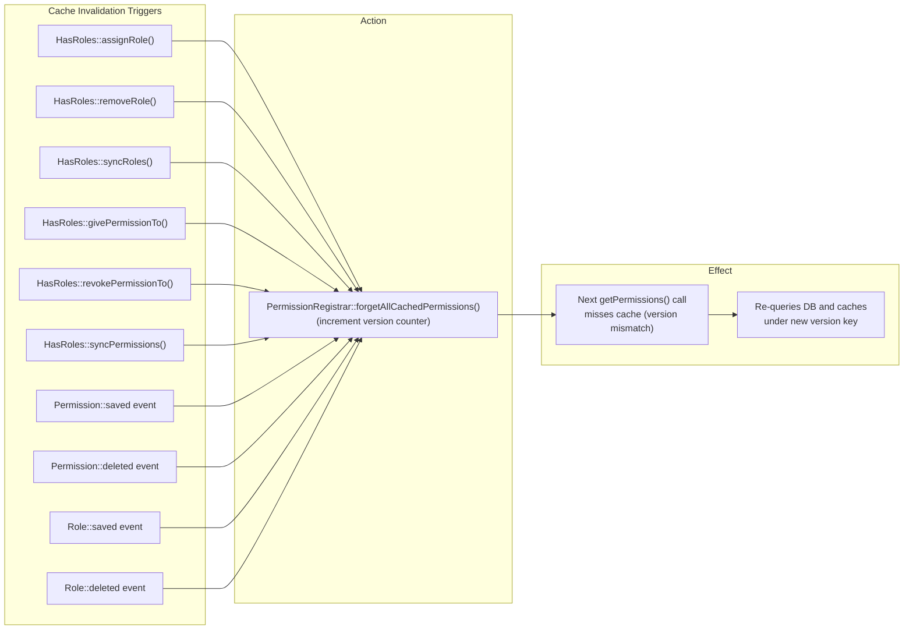

# Built-in Role/Permission System

The package ships an **optional** built-in role/permission system at `Sopheak\Core\Authorization`. It is disabled by default — existing apps see zero change.

When enabled, it replaces the default `Gate::forUser()->allows()` flow with an integrated system that auto-registers permissions from `config/record.php`, caches resolved permissions per user via a version-based cache key, and provides a Spatie-compatible developer API.



## Configuration

### Enable

```bash
SP_PERMISSION_ENABLED=true
```

Or in `config/sp-permissions.php` (`config/permissions.php` on a project that
has not renamed its config files yet — both load under the `permissions` key):

```php
'enabled' => true,
```

### Full Config Reference

```php
// config/sp-permissions.php (published after php artisan vendor:publish --tag=sp-laravel-api-config)
return [
    'enabled'                 => env('SP_PERMISSION_ENABLED', false),
    'auto_register'           => env('SP_PERMISSION_AUTO_REGISTER', true),
    'auto_register_functions' => env('SP_PERMISSION_AUTO_REGISTER_FUNCTIONS', true),
    'cache_ttl'               => env('SP_PERMISSION_CACHE_TTL', 3600),
    'tenant_scoped'           => env('SP_PERMISSION_TENANT_SCOPED', false),
    'super_admin_callback'    => null, // fn ($user) => $user->tokenCan('super-admin') || $user->is_admin,
    'migrate_from_legacy'     => env('SP_PERMISSION_MIGRATE_FROM_LEGACY', false),
];
```

### Auto-Registration

When `auto_register = true`, the system scans **every table** in `config/record.php` on boot and creates permissions based on `pmsName` + `can*` flags:

| Config Flag | Permission Created |
|-------------|-------------------|
| `pmsName: 'invoice'`, `canRead: true` | `view:<separator>invoice` |
| `pmsName: 'invoice'`, `canCreate: true` | `create:<separator>invoice` |
| `pmsName: 'invoice'`, `canUpdate: true` | `update:<separator>invoice` |
| `pmsName: 'invoice'`, `canDelete: true` | `delete:<separator>invoice` |

Custom `permissions` maps on `RecordTableType` are also registered (e.g., `'read' => 'view_invoice'`).

### Config Hash Boot Optimization

`PermissionRegistrar::autoRegisterFromConfig()` computes a hash of relevant table config fields (`pmsName`, `canRead`, `canCreate`, `canUpdate`, `canDelete`, `permissions`, function `pmsName` entries) and caches it. On subsequent boots, if the hash matches, the entire registration loop is skipped — avoiding N+1 `firstOrCreate` queries on every request when config is unchanged.

## Architecture

### Component Overview

| Component | Namespace | Responsibility |
|-----------|-----------|----------------|
| `PermissionRegistrar` | `Sopheak\Core\Authorization` | Gate registration, user-level permission cache, config-driven auto-registration, version-based cache invalidation |
| `PermissionService` | `Sopheak\Core\Authorization` | Business logic helpers for permission/role queries and management |
| `Permission` (Model) | `Sopheak\Core\Authorization\Models` | Permission entity with `roles()` BelongsToMany; fires `saved`/`deleted` → invalidate cache |
| `Role` (Model) | `Sopheak\Core\Authorization\Models` | Role entity with `permissions()` BelongsToMany; fires `saved`/`deleted` → invalidate cache; `deleting` → blocks system role deletion |
| `HasRoles` (Trait) | `Sopheak\Core\Authorization\Traits` | Spatie-compatible trait: 16 public methods for role/permission assignment and querying; tenant-scoped morphToMany |

### Auth Flow



### Cache Invalidation Flow



## Super-Admin Bypass

Users who should have **unrestricted access** (e.g., root admins, Passport `super-admin` scope) can bypass the entire permission check without assigning every permission explicitly.

Configure a callback in `config/permissions.php`:

```php
'super_admin_callback' => fn ($user) => $user->tokenCan('super-admin') || $user->is_admin,
```

The callback receives the authenticated user and **must return `bool`**. When `true`, `authorizeAction()` returns immediately — no DB queries for roles/permissions are executed.

```php
// Default: null — all users must have explicit permissions
'super_admin_callback' => null,
```

The callback runs **after** authentication and permission name resolution but **before** the permission lookup loop. This means:
- Unauthenticated requests still get 401 (bypass only applies after `auth()->user()` resolves)
- Permission names are still resolved (for logging/debugging), but checking is skipped
- No Gate/DB queries are executed for bypassed users

### Example: Passport + Admin Flag

```php
'super_admin_callback' => function ($user) {
    // Passport token scope
    if ($user->tokenCan('super-admin')) {
        return true;
    }

    // Application-level admin flag
    if (!empty($user->is_admin)) {
        return true;
    }

    return false;
},
```

### Example: Check via Role Model

```php
use Sopheak\Core\Authorization\Models\Role;

'super_admin_callback' => function ($user) {
    return $user->hasRole('super-admin');
},
```

> **Note:** The role-based example above queries the DB every request — it partially defeats the purpose of the bypass. Prefer scope/attribute-based checks when possible.

## Tables

Five tables are created by the migration `2026_05_13_000000_create_sp_permissions_tables.php`:

| Table | Purpose |
|-------|---------|
| `sp_permissions` | Permission registry (id, name, group, guard_name, description) |
| `sp_roles` | Role definitions (id, name, key, guard_name, description, is_system, is_master, is_default, tenant_id*) |
| `sp_role_permissions` | Role ↔ Permission pivot (role_id, permission_id, tenant_id*) |
| `sp_model_has_roles` | Polymorphic model ↔ Role pivot (model_type, model_id, role_id, tenant_id) |
| `sp_model_permissions` | Polymorphic model ↔ Permission pivot (model_type, model_id, permission_id, tenant_id) |

`sp_permissions` and `sp_roles` are auto-exposed as CRUD endpoints via `RecordTableType`:
- `sp_permissions`: `canCreate: false` (auto-registered), `canUpdate: true`, `canDelete: false`
- `sp_roles`: `canCreate: true`, `canUpdate: true`, `canDelete: true`

*`tenant_id` is only added when `record.enable_tenant_id = true`.

## Validating Setup

```bash
php artisan sp-laravel-api:validate
```

The validation command checks for:
- `sp_*` permission tables exist
- Permission system enabled/disabled status
- Detection of legacy permission tables with migration hint

## Related Docs

- [Permission API Reference](/guide/feature-permission-api-reference) — PermissionRegistrar / PermissionService / HasRoles, cache, tenant scoping, legacy migration, usage
- [Own-Records Scoping (viewOwn)](/guide/feature-permission-own-records) — restrict list queries to own rows
- [PostgreSQL Row-Level Security](/guide/feature-permission-rls) — RLS defense-in-depth
- [Userstamps](/guide/feature-userstamps) — the `created_by_id`/`last_updated_by_id` audit columns own-records scoping reads
