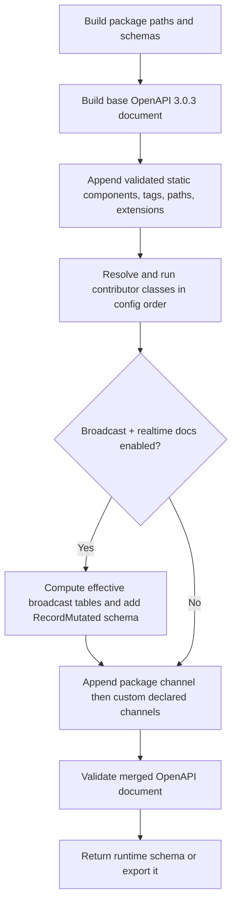

# OpenAPI Realtime and Application Contributions

## Problem

`OpenApiService::generateInternal()` produces the package's OpenAPI 3.0.3
document from dynamic record and RPC configuration. It correctly represents
the package-owned HTTP API, but clients cannot discover two kinds of declared
capability from the same document:

- package record-mutation broadcasts: the channel pattern, event pattern,
  effective table scope, and payload; and
- application-owned API routes and realtime channels that are intentionally
  supported by a consuming Laravel application.

The package must not inspect Laravel channel authorization closures or infer
application routes. Both can contain arbitrary business rules and such
discovery could publish unsupported or sensitive information. The application
must instead explicitly declare documentation it wants to expose.

## Goals

1. Add opt-in, machine-readable metadata for the package-owned
   `RecordMutated` broadcast contract.
2. Let an application append its own HTTP paths, reusable components, tags,
   and `x-*` metadata to the generated document.
3. Offer a class-based contribution API when plain configuration is not enough.
4. Keep all configuration compatible with `php artisan config:cache`.
5. Reject invalid or colliding contributions before any OpenAPI document is
   returned or exported.
6. Preserve the current output byte-for-byte in structure when no new option
   is enabled or configured.

## Non-goals

- Discovering `routes/channels.php`, channel authorization closures, roles,
  permissions, controllers, or arbitrary application route registrations.
- Changing HTTP runtime behavior, broadcast behavior, authorization, or the
  existing OpenAPI `security` and `x-sp-auth` contracts.
- Publishing broadcaster hostnames, app keys, private keys, secrets, or
  environment-specific server credentials.
- Upgrading the package's emitted OpenAPI version from 3.0.3 to 3.1.
- Generating AsyncAPI in this release. A later feature can reuse the realtime
  definitions introduced here.

## Current facts to preserve

- The generated document declares `openapi: 3.0.3`.
- `RecordMutated` broadcasts on Laravel private channel `tenant.{tenantId}`;
  missing tenant context uses `tenant.global`.
- Its event name is `{table}.{action}` and its payload has `table`, `action`,
  `record`, `tenant_id`, and `timestamp`.
- Broadcast eligibility is controlled by `record.broadcast_events`, the
  optional `record.broadcast_tables` allow-list, and
  `RecordTableType::$disableBroadcast`.
- Existing RPC documentation already accepts explicitly supplied OpenAPI
  request, query, and response schemas. This feature follows the same
  principle: explicit client-owned metadata, never guessed metadata.

## Decisions

### 1. Preserve OpenAPI 3.0.3 and use an extension for realtime

The document remains OpenAPI 3.0.3. Realtime metadata is a top-level
`x-sp-realtime` specification extension. OpenAPI tooling that does not know
the extension continues to consume the HTTP document normally.

The extension has a package-defined version so consumers can reject or adapt
future incompatible formats without guessing:

```json
{
  "x-sp-realtime": {
    "version": "1.0",
    "transport": "laravel-broadcasting",
    "channels": []
  }
}
```

The feature is enabled only when both `record.broadcast_events` and
`sp-laravel-api.openapi.realtime.enabled` are true. When either is false,
`x-sp-realtime` is absent; an empty extension is never emitted.

### 2. Use one canonical definition shape for package and application channels

`x-sp-realtime.channels` is an ordered list. Every entry uses this shape:

```json
{
  "name": "record-mutations",
  "pattern": "tenant.{tenantId}",
  "private": true,
  "parameters": {
    "tenantId": {
      "description": "Tenant identifier. Omit only for the tenant.global fallback.",
      "schema": { "type": "string" }
    }
  },
  "events": [
    {
      "pattern": "{table}.{action}",
      "payload": { "$ref": "#/components/schemas/RecordMutated" }
    }
  ],
  "authorization": "Private-channel authorization is implemented by the host application."
}
```

`name` is a stable, unique documentation identifier; it is not a Laravel
channel name. `pattern` is the Laravel channel name without the transport UI
prefix `private-`. `parameters` documents every `{placeholder}` in the
pattern. `events` may contain one or more fixed `name` or pattern-based
`pattern` entries, but not both on the same event.

### 3. Generate a deliberately broad `RecordMutated` schema

Add `components.schemas.RecordMutated` only when the package realtime
extension is emitted:

```json
{
  "type": "object",
  "required": ["table", "action", "record", "tenant_id", "timestamp"],
  "properties": {
    "table": {
      "type": "string",
      "enum": ["invoices", "payments"]
    },
    "action": {
      "type": "string",
      "description": "The emitted mutation action; clients must not assume a closed enum."
    },
    "record": {
      "type": "object",
      "additionalProperties": true,
      "description": "The affected record. Its fields depend on table and mutation response shape."
    },
    "tenant_id": {
      "description": "Tenant identifier, or null when the event uses tenant.global."
    },
    "timestamp": {
      "type": "string",
      "format": "date-time"
    }
  }
}
```

The `table` enum is the effective broadcast scope after applying the global
allow-list and per-table opt-out. `record` remains open because its actual
shape varies by table and can include application-defined fields. `action`
also remains open because the runtime forwards operations beyond basic CRUD
(for example upsert and force-delete) and new operations may be added later.

### 4. Publish custom channels through static config

The package config gains the following defaults under the existing
`sp-laravel-api.openapi` key:

```php
'openapi' => [
    'output' => 'openapi-schema.json',
    'realtime' => [
        'enabled' => false,
        'channels' => [],
    ],
    'contributions' => [
        'paths' => [],
        'components' => [],
        'tags' => [],
        'extensions' => [],
        'contributors' => [],
    ],
],
```

Applications add custom realtime entries to `realtime.channels`. They may
reference a package-generated or application-contributed component schema.
They must declare the channel explicitly; the package does not compare them
with Laravel's channel registrations.

Example application-owned channel and schema:

```php
'openapi' => [
    'realtime' => [
        'enabled' => true,
        'channels' => [
            [
                'name' => 'booking-status',
                'pattern' => 'booking.{bookingId}',
                'private' => true,
                'parameters' => [
                    'bookingId' => [
                        'description' => 'Booking UUID.',
                        'schema' => ['type' => 'string', 'format' => 'uuid'],
                    ],
                ],
                'events' => [
                    [
                        'name' => 'booking.status.updated',
                        'payload' => ['$ref' => '#/components/schemas/BookingStatusUpdated'],
                    ],
                ],
                'authorization' => 'The user must be allowed to view the booking.',
            ],
        ],
    ],
    'contributions' => [
        'components' => [
            'schemas' => [
                'BookingStatusUpdated' => [
                    'type' => 'object',
                    'required' => ['booking_id', 'status'],
                    'properties' => [
                        'booking_id' => ['type' => 'string', 'format' => 'uuid'],
                        'status' => ['type' => 'string'],
                    ],
                ],
            ],
        ],
    ],
],
```

### 5. Add constrained contributions for application-owned HTTP documentation

`openapi.contributions` lets an application append documentation for routes it
owns. The document path is absolute relative to the configured server URL, so
it must include the application's active API prefix when applicable.

```php
'contributions' => [
    'tags' => [
        ['name' => 'Reports', 'description' => 'Application reporting routes.'],
    ],
    'paths' => [
        '/api/v1/reports/monthly' => [
            'get' => [
                'tags' => ['Reports'],
                'summary' => 'Get monthly report',
                'operationId' => 'getMonthlyReport',
                'responses' => [
                    '200' => [
                        'description' => 'Monthly report.',
                        'content' => [
                            'application/json' => [
                                'schema' => ['$ref' => '#/components/schemas/MonthlyReport'],
                            ],
                        ],
                    ],
                ],
            ],
        ],
    ],
    'components' => [
        'schemas' => [
            'MonthlyReport' => [
                'type' => 'object',
                'properties' => ['month' => ['type' => 'string']],
            ],
        ],
    ],
    'extensions' => [
        'x-client-documentation' => ['owner' => 'reporting-team'],
    ],
],
```

Allowed component groups are the OpenAPI 3.0.3 Component Object groups:
`schemas`, `responses`, `parameters`, `examples`, `requestBodies`, `headers`,
`securitySchemes`, `links`, and `callbacks`. Top-level `webhooks` are not
accepted because they are not part of the package's declared OpenAPI 3.0.3
contract.

### 6. Provide a class-based contributor for reusable or computed definitions

Plain arrays cover most clients. A class-string option supports a reusable
application module without sacrificing config caching:

```php
'contributors' => [
    App\OpenApi\ReportingOpenApiContributor::class,
],
```

Introduce these package contracts:

```php
interface OpenApiDocumentContributorInterface
{
    public function contribute(OpenApiDocumentBuilder $document): void;
}
```

`OpenApiDocumentBuilder` exposes only append operations:

```php
addPath(string $path, array $pathItem): void;
addComponent(string $group, string $name, array $definition): void;
addTag(array $tag): void;
addExtension(string $name, mixed $value): void;
```

Contributor classes are resolved through Laravel's container when the
document is generated. The config contains only class strings—never closures,
object instances, request state, or secrets. A contributor cannot receive the
mutable root specification or replace package-owned sections.

Static contributions are applied first, then contributor classes in declared
order. All collision checks use the same shared builder, so behavior is
deterministic and errors name the conflicting source.

## Merge and ownership rules

The generated package document is authoritative. Contributions are append-only.

| Area | Client may add | Collision behavior |
| --- | --- | --- |
| `paths` | A new path item or a new HTTP method on an otherwise unused path | Throw; never replace a package path/method |
| `components` | Named definitions in allowed component groups | Throw on existing group/name |
| `tags` | A tag with a new name | Throw on duplicate name |
| Root `extensions` | Any non-reserved `x-*` key | Throw on existing or `x-sp-*` key |
| `x-sp-realtime.channels` | Declared application channels with a new `name` | Throw on duplicate channel name |

Clients use native OpenAPI `security` on their own operations when needed. The
package reserves the `x-sp-*` namespace, including `x-sp-auth`, because those
fields have package-defined semantics. Client-specific annotations should use
a separate namespace such as `x-client-*`.

## Validation and error handling

### Contribution validation

Validate static configuration and every builder call before merging it:

- all contribution values are arrays or permitted scalar extension values;
- a path begins with `/` and contains a valid Path Item Object;
- an operation has a non-empty `summary`, a globally unique `operationId`, and
  at least one response;
- a path template placeholder has a matching `in: path`, `required: true`
  parameter;
- component group names and component keys are valid for OpenAPI 3.0.3;
- tags contain a non-empty unique `name`;
- extension names begin with `x-` and do not use `x-sp-*`;
- contributor class strings exist, are instantiable by the container, and
  implement `OpenApiDocumentContributorInterface`.

Realtime validation additionally requires:

- unique non-empty channel `name` values;
- a non-empty `pattern`, valid placeholder names, and exactly matching
  `parameters` keys;
- boolean `private`;
- a non-empty `events` list;
- exactly one of `name` or `pattern` for every event;
- a non-empty payload schema or local `#/components/...` reference; and
- an optional string `authorization` description.

After all contributions merge, validate the complete OpenAPI 3.0.3 document,
including component references and global `operationId` uniqueness. The
implementation may use a dedicated document validator, but no validator
dependency is selected by this design. The chosen validator must support
OpenAPI 3.0.3 and run in the package's supported PHP versions.

### Failure behavior

Use a dedicated `OpenApiContributionException` with the source configuration
path or contributor class, the invalid key, and the violated rule. Generation
is atomic: a failed contribution produces no partially merged document.

- The runtime OpenAPI endpoints use their existing error response behavior.
- `sp-laravel-api:export-openapi` reports the exception and exits with failure
  without writing an output file.
- Bruno and Postman exporters receive the same failure because they already
  consume `OpenApiService::generateInternal()`.

## Generation flow



## Implementation outline

1. Add default `openapi.realtime` and `openapi.contributions` entries to
   `config/sp-laravel-api.php` and the setup-command config template.
2. Add `OpenApiDocumentContributorInterface`, `OpenApiDocumentBuilder`, and
   `OpenApiContributionException` under the package's existing contracts,
   service/support, and exception conventions.
3. Add an `OpenApiContributionService` responsible for static configuration,
   class contributor resolution, collision detection, and structural
   validation.
4. Extend `OpenApiService::generateInternal()` to build the base document,
   invoke the contribution service, conditionally add realtime metadata, and
   perform final validation.
5. Update `docs/guide/api/api-realtime-openapi-attribute-config.md` with the
   extension format, configuration examples, privacy boundary, and application
   route contribution example.
6. Update `docs/guide/api/api-custom-function-endpoints.md` to distinguish
   package RPC schemas from application-owned route documentation.

## Tests

Add focused feature tests covering:

1. Default configuration: no `x-sp-realtime`, no `RecordMutated` component,
   and unchanged package paths/components.
2. Realtime enabled without record broadcasting: no realtime extension.
3. Both switches enabled: extension contains the package channel, effective
   table enum, expected event pattern, and the exact five payload fields.
4. Broadcast allow-list and `disableBroadcast` both reduce the advertised
   table enum correctly.
5. A valid custom channel and contributed schema appear in the correct places.
6. A valid client path, tag, component, and `x-client-*` extension merge and
   remain visible through runtime OpenAPI and the export command.
7. All collision classes fail clearly: package path/method, component, tag,
   channel, root extension, and `operationId`.
8. Invalid path placeholders, missing responses, malformed realtime entries,
   missing contributor classes, and invalid contributor interfaces fail with
   precise errors.
9. A contributor receives the builder, can append valid definitions, and
   cannot replace package-owned definitions.
10. An application config using arrays and contributor class strings survives
    `config:cache`.
11. Existing OpenAPI paths, component schemas, `security` fields, `x-sp-auth`,
    Bruno output, and Postman output remain compatible.

## Compatibility and release notes

This is additive and opt-in. Existing applications have neither realtime
metadata nor contributions configured, so their generated document remains
structurally unchanged. Adding a contributed endpoint makes Bruno/Postman
exporters see that endpoint; this is expected because they intentionally export
the final OpenAPI document.

Document the new configuration in the changelog, including that it publishes
documentation only and does not configure or authorize broadcast connections.

## Future follow-ups

Prioritized after this feature proves useful:

1. Generate an AsyncAPI document from the same validated realtime channel
   definitions; do not duplicate channel configuration.
2. Add an optional CI command that validates an exported OpenAPI file without
   booting the full application.
3. Add a documented consumer helper for Laravel Echo/Soketi clients; keep it
   outside the core package unless it remains transport-agnostic.
